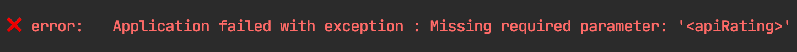

[](https://travis-ci.org/github/tahabasri/take-a-hint)
[](https://codecov.io/gh/tahabasri/take-a-hint)
[](https://twitter.com/intent/follow?screen_name=TheTahaBasri) 


# take-a-hint
Give final users hints when getting error messages without the need for documentation.

## Introduction
Wouldn't be beneficial to give users hints about what went wrong with a 
failing command right away, without the need to open any documentation ?

take-a-hint (a.k.a. Hint) is a tiny framework to change the look-and-feel of Java error messages. 
Giving the possibility to add hints on top of error message, final user can take-a-hint as quick as possible.

## How it works
Given the following example:
```java
public class Spaceship {
    public static void main(String[] args) {
        Spaceship main = new Spaceship();
        main.goToMars();
    }

    private void goToMars() {
        throw new IllegalStateException("Oxygen leak detected !");
    }
}
```
Typically, executing this will result in the stacktrace we are all familiar with:


Adding Hint is as simple as initializing a Hint object using your main class:
```java
public class Spaceship {
    public static void main(String[] args) {
        Spaceship main = new Spaceship();
        new HintCommand(main).init();
        main.goToMars();
    }
    // ...
}
```
Executing the new program, we get a new look for our error message.


By default, take-a-hint shows the essential part of the error which is the error message.
You can customize your final look further more and obtain something like:


### Customization

take-a-hint comes with pre-defined look-and-feel for your Java error messages. Still, you can -and should- customize final messages depending on your needs.

take-a-hint offers a set of components you can customize in code to configure final error messages.

| Component                 | Default value                         | Description |
| ---------                 | -------------                         | ----------- |
| showStackTrace            | false                                 | shows or hides stacktrace in final output |
| showHints                 | true                                  | shows or hides hints messages in final output |
| defaultExceptionMessage   | 'Application failed with exception :'   | default message for exceptions without custom error message |
| defaultDocsMessage        | 'See the docs for details : '           | default message for notes about documentations |
| defaultExitCode           | 1                                     | default exit code to be used by your program when an uncaught exception gets thrown |
| hintPrefix                | '✅ hints:'                             | default prefix to be used for each line in hints messages |
| errorPrefix               | '❌ error:'                             | sets default prefix to be used for each line in error messages |
| stackPrefix               | '⛔ stack:'                             | default prefix to be used for each line in stacktrace |
| docsPrefix                | ❔ usage:                             | default prefix to be used for each line in usage messages (docs) |
| defaultDocsSeparator      | '---'                                   | default separator to be used before showing documentation message |
| defaultSeparator          | \t                                    | default separator to be used between each token in final output |
| docsUrl                   |                                       | global documentation url, if unset, documentation help message won't show up on your final output |

In order to configure how error messages appear, you can use following options:

- via programmatic API:
```java
class Spaceship{
    public static void main(String[] args){
        new HintCommand(new Spaceship())
                .errorPrefix("[ERROR] :")
                .showStackTrace(true)
                .docsUrl("https://github.com/tahabasri/take-a-hint")
                .init();
    }
}
```

- via annotations:
```java
@Hint(
        errorPrefix = "[ERROR] :",
        showStackTrace = true,
        docsUrl = "https://github.com/tahabasri/take-a-hint"
)
class Spaceship{
    public static void main(String[] args){
        new HintCommand(new Spaceship()).init();
    }
}
```

When mixing annotation and programmatic API, take-a-hint will opt for configuration by programmatic API.

### Use with Picocli

[Picocli](https://picocli.info/) is a one-file framework for creating Java command line applications with almost zero code.

In order to add take-a-hint features to your Picocli application, you need to use Hint custom handlers.
```java
@CommandLine.Command
@Hint // this is optional
public class PicocliWithHint implements Runnable {

    @CommandLine.Parameters
    int apiRating;

    public static void main(String[] args) {
        PicocliWithHint picocliWithHint = new PicocliWithHint();
        CommandLine cmd = new CommandLine(picocliWithHint);
        HintCommand hintCmd = new HintCommand(picocliWithHint);
        // add custom handler for parameter exceptions
        cmd.setParameterExceptionHandler(new PicocliParameterExceptionHandler(hintCmd));
        // add custom handler for all other exceptions
        cmd.setExecutionExceptionHandler(new PicocliExecutionExceptionHandler(hintCmd));
        System.exit(cmd.execute(args));
    }

    @Override
    public void run() {
        if (apiRating < 3) {
            throw new RuntimeException("Not cool !");
        }
    }
}
```

After wiring take-a-hint with Picocli, exceptions will be shown with Hint style.

- When running Picocli program without required parameter `apiRating`, we get:



- When running Picocli with incompatible parameter for `apiRating`, we get:


### How to use your own Emoji characters in your Java command-line application

take-a-hint comes with pre-defined messages with a set of Emojis, you can change yours via the configuration:

- via annotations, you can set your default prefix for error messages :
```java
@Hint(errorPrefix = "\u26D4 error :")
class Spaceship{
    new HintCommand(new Spaceship()).init();
}
```

Your final message will be 
```
⛔ error :   Spaceship is no longer a ship!
```

- via programmatic API, you can achieve the same result via the following method:
```java
class Spaceship{
    public static void main(String[] args){
      new HintCommand(new Spaceship()).errorPrefix("\u26D4 error :").init();
    }
}
```

To use a new Emoji, you can follow the steps bellow:
- Visit [Full Emoji List, v13.0](https://unicode.org/emoji/charts/full-emoji-list.html) and find emoji to use.
- Copy the code in `Code` column and make a search in 
[fileformat.info](http://www.fileformat.info/info/unicode/char/search.htm) using the copied code as query string.
- Click on the returned result (end of page) and copy the value for column `C/C++/Java source code`.
- Put the value in your prefix string and recompile your program, it should show the new Emoji.